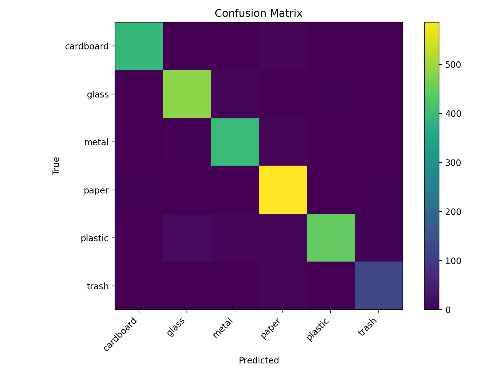

# 🗑️ Eco Waste Monitoring  
### Автоматическая классификация бытовых отходов с использованием компьютерного зрения

Проект посвящён задаче автоматической классификации бытовых отходов по изображениям
с применением методов компьютерного зрения и предобученной нейронной сети.
Работа ориентирована на задачи экологического мониторинга и устойчивого управления отходами.

---

## 🌍 Актуальность и мотивация

Проблема обращения с бытовыми отходами напрямую влияет на состояние экосистем.
Ошибки при сортировке мусора замедляют процессы переработки, увеличивают объёмы
полигонов и приводят к попаданию пластика и других трудноразлагаемых материалов
в почву и водоёмы.

Автоматизированные системы распознавания отходов по изображениям способны повысить
точность сортировки, снизить нагрузку на окружающую среду и ускорить
перерабатывающие процессы, что делает данное направление актуальным с точки зрения
экологического мониторинга и устойчивого развития.

Практические примеры применения искусственного интеллекта в экологии уже
существуют: нейросетевые алгоритмы используются для анализа аэрофотоснимков
береговых линий, выявления скоплений мусора и оценки масштабов загрязнений,
что значительно упрощает планирование экологических мероприятий.

---

## 🎯 Цель проекта

Оценить качество предобученной модели компьютерного зрения для классификации
бытовых отходов на публичном датасете TrashNet и проанализировать основные ошибки
классификации.

---

## 🧠 Используемая модель

- **Модель:** `prithivMLmods/Trash-Net`
- **Платформа:** Hugging Face Hub
- **Тип:** сверточная нейронная сеть (CNN)
- **Задача:** классификация изображений
- **Количество классов:** 6

### Классы отходов:
- cardboard
- glass
- metal
- paper
- plastic
- trash

---

## 📂 Датасет

- **Название:** TrashNet (dataset-resized)
- **Количество изображений:** 2527
- **Источник:** https://github.com/garythung/trashnet
- **Описание:** изображения бытовых отходов, распределённые по папкам в соответствии с классами

---
## 📊 Результаты и оценка модели

- **Accuracy:** 95.9%
- **Dataset:** TrashNet (2527 изображений, 6 классов)

```bash
pip install -r requirements.txt
```
## Confusion Matrix


Классы *plastic* и *glass* чаще всего путаются между собой из-за визуального сходства.

---

## ⚙️ Подготовка окружения и запуск

### Установка зависимостей и запуск эксперимента:
```bash
pip install -r requirements.txt
python -m src.download_data
python -m src.evaluate
```
